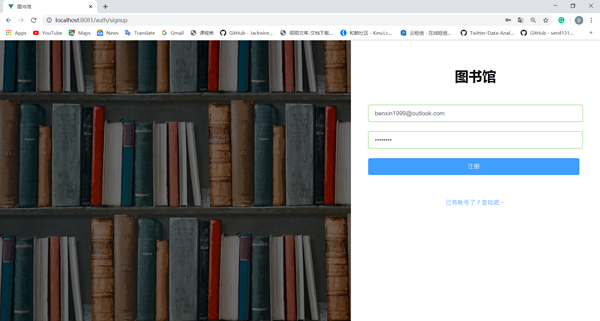
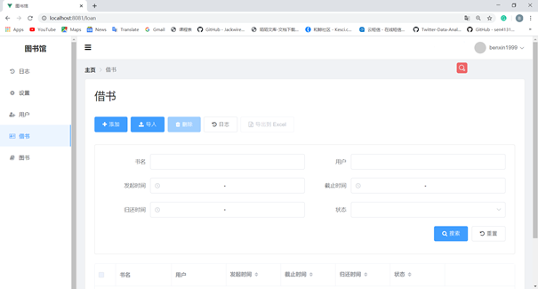
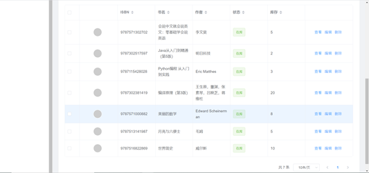
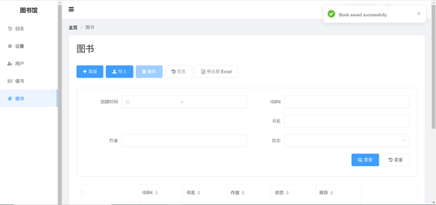
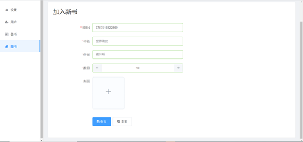

# Library web application with Vue JS, Node JS, and SQL

Users include users and administrators.
- Users can only borrow, return books and query book information. The system ensures a logical relationship between the borrow date, return date, and the deadline.  Each event of borrowing and returning books has a corresponding record.
- The administrator manages the users and maintains the related database. In detail:
  1. adding and deleting users, setting permissions (such as changing user roles, or banning some of the offending readers) and other functions.
  2. maintaining book-related information, including adding books, deleting books, modifying book information, and querying books; the administrator maintains book status information, which will determine whether readers can successfully reserve books.

## Dependency
Front End
- Vue.js
- NodeJS
- Vuex
- Element UI
- ExpressJS
Backend
- SQL

## Run Locally
- Install the database locally
backend\config
- Open 'frontend/src/config/localhost.js'
  - Set your custom configs
- Open 'backend/config/localhost.js'
  - Set your custom configs
- Go to the 'frontend' folder
  - Run `npm run install`
  - Run `npm run start`
- Go to the 'backend' folder
  - Run `npm run install`
  - Run `npm run start`
- Create the database tables
  - Run `npm run db:reset:localhost`
(This command will DROP ALL THE DATABASE TABLES. Make sure you are running it pointing to the correct database.)
- The app will be available at https://localhost:8080.

## Demo
### login

### request to borrow/return book

### browse the booklist

### librarian view

### book management

